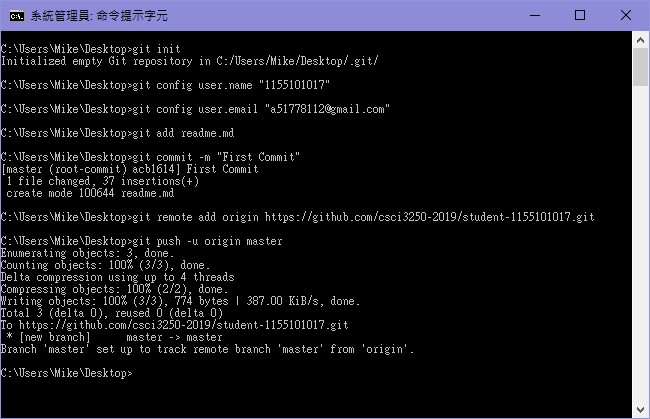

# :newspaper: Introduce Myself to You

Hello There! I am **Li Chun Tat**,aka **Mike Li**, a year 2 Information Engineering Student in Chinese University of Hong Kong :school:

## :heart_eyes: About Me 

* Love Watching Movies :movie_camera:
* Would like to create my own game :video_game: 
* My first time to GitHub :joy:

## :fire: The Project Tasks

- [x] Project Milestone #1
- [x] Project Milestone #2
- [ ] Project Milestone #3

## Time and Date Finishing the Above Tasks

Project Tasks | Finished Time
--------------|--------------
Project Milestone #1 | 2019-04-03 02:43 P.M.
Project Milestone #2 | 2019-04-20 02:00 A.M.
Project Milestone #3 | N/A

##  :camera: Screenshot

## Author

- **Mike Li** - [1155101017](https://github.com/1155101017)

## Acknowledgement

- [Standard-Readme](https://github.com/RichardLitt/standard-readme) - Standard Readme Style
